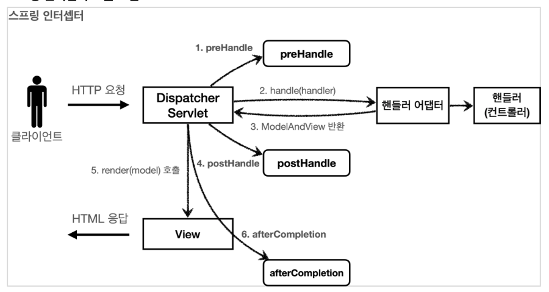

## 서블릿 필터

### 서블릿 필터 소개 

필터는 서블릿이 지원하는 수문장이다. 필터의 특성은 다음과 같다

**필터 흐름**

~~~
HTTP 요청 -> WAS -> 필터 -> 서블릿 -> 컨트롤러
~~~

필터를 적용하면 필터가 호출된 다음에 서블릿이 호출된다. 그래서 모든 고객의 요청 로그를 남기는 요구사항이 있다면 필터를 사용하면 된다. 참고로 필터는 특정 URL 패턴에 적용할 수 있다. `/*` 이라고 하면 모든 요청에 필터가 적용된다.

스프링을 사용하는 경우 여기서 말하는 서블릿은 스프링의 디스패처 서블릿으로 생각하면된다.


**필터 제한**

~~~
HTTP 요청 -> WAS -> 필터 -> 서블릿 -> 컨트롤러 //로그인 사용자
HTTP 요청 -> WAS -> 필터(막힘. 적절하지 않은 요청이라 판단) //비로그인 사용자
~~~

필터에서 적절하지 않은 요청이라고 판단하면 거기에서 끝을 낼 수도 있다. 그래서 로그인 여부를 체크하기에 딱 좋다.


**필터 체인**

~~~
HTTP 요청 -> WAS -> 필터1 -> 필터2 -> 필터3 -> 서블릿 -> 컨트롤러
~~~

필터는 체인으로 구성되는데, 중간에 필터를 자유롭게 추가할 수 있다. 예를 들어서 로그를 남기는 필터를 먼저 적용하고, 그 다음에 로그인 여부를 체크하는 필터를 만들 수 있다.


 **필터 인터페이스**

~~~java
public interface Filter {

    public default void init(FilterConfig filterConfig) throws ServletException {}

   
    public void doFilter(ServletRequest request, ServletResponse response,
            FilterChain chain) throws IOException, ServletException;

    public default void destroy() {}
}
~~~

필터 인터페이스를 구현하고 등록하면 서블릿 컨테이너가 필터를 싱글톤 객체로 생성하고, 관리한다.

- `init()` : 필터 초기화 메서드, 서블릿 컨테이너가 생성될 때 호출된다.
- `doFilter()` : 고객의 요청이 올 때 마다 해당 메서드가 호출된다. 필터의 로직을 구현하면 된다.
- `destroy()` : 필터 종료 메서드, 서블릿 컨테이너가 종료될 때 호출된다.


### Logfilter 구현

```java
public class LogFilter implements Filter {
    @Override
    public void init(FilterConfig filterConfig) throws ServletException {
        log.info("log filter init");
    }

    @Override
    public void doFilter(ServletRequest request, ServletResponse response, FilterChain chain) throws IOException, ServletException {
        log.info("log filter doFilter");

        HttpServletRequest httpRequest = (HttpServletRequest) request;
        String requestURI = httpRequest.getRequestURI();

        String uuid = UUID.randomUUID().toString();

        try {
            log.info("REQUEST [{}][{}]", uuid, requestURI);
            chain.doFilter(request, response);
        } catch (Exception e) {
            throw e;
        } finally {
            log.info("RESPONSE [{}][{}]", uuid, requestURI);
        }
    }

    @Override
    public void destroy() {
        log.info("log filter destroy");
    }
}
```

1. Filter를 구현하기위해 `Filter [Java.sevlert]` 인터페이스를 상속받는다.
2. Http 요청이 들어오면 `doFilter()`가 호출된다.
   1. doFilter에 filter가 호출 시 수행할 로직을 구현한다.
3. `chain.doFilter` 를 호출하면 다음에 필터가 있으면 필터를 호출하고, 필터가 없으면 서블릿이 호출된다.
   - **꼭 호출해줘야 한다. 그래야만 Controller에 접근할 수 있기 때문이다. 즉 호출을 안하면 다음으로 안넘어간다.**


```java
@Configuration
public class WebConfig {

    @Bean
    public FilterRegistrationBean logFilter() {
        FilterRegistrationBean<Filter> filterRegistrationBean = new FilterRegistrationBean<>();

        filterRegistrationBean.setFilter(new LogFilter());
        filterRegistrationBean.setOrder(1);
        filterRegistrationBean.addUrlPatterns("/*");

        return filterRegistrationBean;
    }
}
```

필터를 등록하는 방법은 여러가지가 있지만 스프링 부트를 사용하면 `FilterRegistrationBean`을 사용해서 등록하면 된다.

- `setFilter()`: 사용자가 직접 만든 필터를 할당해준다.
- `setOrder()`: 필터는 체인으로 동작한다. `setOrder()` 를 통해 필터의 순서를 정한다.

- `addUrlPatterns`: 필터가 호출되는 url을 설정해준다 `"/*"` 로 설정 시 모든 Url에서 필터가 호출된다.


### LoginFilter 구현

```java
@Slf4j
public class LoginCheckFilter implements Filter {

    private static final String[] whiteList = {"/", "members/add", "/login", "/logout", "/css/*"};

    @Override
    public void doFilter(ServletRequest request, ServletResponse response, FilterChain chain) throws IOException, ServletException {

        HttpServletRequest httpRequest = (HttpServletRequest) request;
        String requestURI = httpRequest.getRequestURI();

        HttpServletResponse httpResponse = (HttpServletResponse) response;

        try {
            log.info("인증 체크 필터 시작{}", requestURI);

            if (isLoginCheckPath(requestURI)) {
                log.info("인증 체크 로직 실행 {}", requestURI);
                HttpSession session = httpRequest.getSession(false);
                if (session == null || session.getAttribute(SessionConst.LOGIN_MEMBER) == null) {
                    log.info("미인증 사용자 요청 {}", requestURI);
                    //로그인으로 redirect
                    httpResponse.sendRedirect("/login?redirectURL=" + requestURI);
                    return;
                }
            }

            chain.doFilter(request, response);
        } catch (Exception e) {
            throw e; //예외 로깅 가능 하지만, 톰캣까지 예외를 보내주어야 함
        } finally {
            log.info("인증 체크 필터 종료 {}", requestURI);
        }
    }

    /**
     * 화이트 리스트인 경우 인증 체크 X
     */
    private boolean isLoginCheckPath(String requestURI) {
        return !PatternMatchUtils.simpleMatch(whiteList, requestURI);
    }
}
```

1. 필터가 실행될 때 `isLoginCheckPath` 에서 요청된 URL이 `whiteList`에 해당되는 URL인지 판단된다. 만약에 해당되는 URL 이면 false를 넘겨서 체크를 안하고, 해당 되지 않는 URL이면 세션을 확인한다.
2. 세션이 null 이거나, `LOGIN_MEMBER`가 아니면 login 으로 redirect를 하는데 나중에 로그인을 화면 접속한 화면으로 돌아가기 위해 `redirectURL`을 설정한다.
   1. 설정을 한 뒤, 컨트롤러에 접근할 필요가 없기 때문에 바로 return 한다.


```java
@PostMapping("/login")
public String loginV4(@Valid @ModelAttribute LoginForm form,
                      BindingResult bindingResult,
                      @RequestParam(defaultValue = "/") String redirectURL,
                      HttpServletRequest request) {
    if (bindingResult.hasErrors()) {
        return "login/loginForm";
    }

    Member loginMember = loginService.login(form.getLoginId(), form.getPassword());

    if (loginMember == null) {
        bindingResult.reject("loginFail", "아이디 또는 비밀번호가 맞지 않습니다.");
        return "login/loginForm";
    }

    //로그인 성공 처리
    //세션이 있으면 있는 세션 반환, 없으면 신규 세션을 생성
    HttpSession session = request.getSession();
    //세션에 로그인 회원 정보 보관
    session.setAttribute(SessionConst.LOGIN_MEMBER, loginMember);

    return "redirect:" + redirectURL;
}
```

- 로그인을 성공하면 `redirect:` + 파라미터인 redirectURL로 return 한다.


## 스프링 인터셉터

### 스프링 인터셉터 소개

스프링 인터셉터도 서블릿 필터와 같이 웹과 관련된 공통 관심 사항을 효과적으로 해결할 수 있는 기술이다.

스프링 인터셉터는 **스프링 MVC가 제공하는 기술**이며, **필터와는 다른점은 적용되는 순서와 범위 그리고 사용방법이 다르다.**


**스프링 인터셉터 흐름**

~~~
HTTP 요청 -> WAS -> 필터 -> 서블릿 -> 스프링 인터셉터 -> 컨트롤러
~~~

- 스프링 인터셉터는 디스패처 서블릿과 컨트롤러 사이에서 컨트롤러 호출 직전에 호출 된다.
- 스프링 인터셉터는 스프링 MVC가 제공하는 기능이기 때문에 결국 디스패처 서블릿 이후에 등장하게 된다. 스프링 MVC의 시작점이 디스패처 서블릿이라고 생각하면 이해가 된다.
- 스프링 인터셉터에도 URL 패턴을 적용할 수 있는데, 서블릿 URL 패턴과는 다르고, 매우 정밀하게 사용할 수 있다.


**스프링 인터셉터 제한**

~~~
HTTP 요청 -> WAS -> 필터 -> 서블릿 -> 스프링 인터셉터 -> 컨트롤러 //로그인 사용자
HTTP 요청 -> WAS -> 필터 -> 서블릿 -> 스프링 인터셉터(적절하지 않은 요청이라 판단, 컨트롤러 호출 X) //비 로그인 사용자
~~~

인터셉터에서 적절하지 않은 요청이라고 판단하면 거기에서 끝을 낼 수도 있다.


**스프링 인터셉터 체인**

~~~
HTTP 요청 -> WAS -> 필터 -> 서블릿 -> 인터셉터1 -> 인터셉터2 -> 컨트롤러
~~~

스프링 인터셉터는 체인으로 구성되는데, 중간에 인터셉터를 자유롭게 추가할 수 있다.


**스프링 인터셉터 인터페이스**

스프링의 인터셉터를 사용하려면 `HandleInterceptor` 인터페이스를 구현하면 된다.

```java
public interface HandlerInterceptor {
  
   default boolean preHandle(HttpServletRequest request, HttpServletResponse response, Object handler)
         throws Exception {

      return true;
   }// 컨트롤러 호출되기 전

   default void postHandle(HttpServletRequest request, HttpServletResponse response, Object handler,
         @Nullable ModelAndView modelAndView) throws Exception {
   } // 컨트롤러가 호출 된 후

   default void afterCompletion(HttpServletRequest request, HttpServletResponse response, Object handler,
         @Nullable Exception ex) throws Exception {
   }// HTTP 요청이 완료 된 후

}
```

- 서블릿 필터의 경우 단순하게 `doFilter()` 하나만 제공된다. 인터셉터는 컨트롤러 호출 전(`preHandle`), 호출 후 (`postHandle`), 요청 완료 이후(`afterCompletion`)와 같이 단계적으로 잘 세분화 되어 있다.
- 서블릿 필터의 경우 단순히 `request`, `reponse` 만 제공했지만, 인터셉터는 어떤 컨트롤러(`handler`)가 호출되는지 호출정보도 받을 수 있따. 그리고 어떤 `modelAndView`가 반환되는지 응답정보도 받을 수 있다.


**인터셉터 호출 흐름**



- postHandle
  - 컨트롤러 호출후에 호출된다.
  - **postHandle 은 예외가 발생하면 호출되지 않는다.**
- afterCompletion
  - 뷰가 렌더링 된 이후에 호출된다.
  - **afterCompletion은 예외가 발생해도 호출이 된다. 그래서 Exception을 파라미터로 받아서 어떤 예외가 발생했는지 확인할 수 있다.**


**정리**

인터셉터는 스프링 MVC 구조에 특화된 필터 기능을 제공한다. 스프링 MVC를 사용하고, 특별히 필터를 꼭 사용해야 하는 상황이 아니라면 인터셉터를 사용하는 것이 더 편리하다.


### 로그 인터셉터 구현

```java
@Slf4j
public class LogInterceptor implements HandlerInterceptor {

    public static final String LOG_ID = "logId";

    @Override
    public boolean preHandle(HttpServletRequest request, HttpServletResponse response, Object handler) throws Exception {

        String requestURI = request.getRequestURI();
        String logId = UUID.randomUUID().toString();

        request.setAttribute(LOG_ID, logId);
        if (handler instanceof HandlerMethod) {
            HandlerMethod hm = (HandlerMethod) handler;
        }

        log.info("REQUEST [{}][{}][{}]", logId, requestURI, handler);

        return true;
    }

    @Override
    public void postHandle(HttpServletRequest request, HttpServletResponse response, Object handler, ModelAndView modelAndView) throws Exception {
        log.info("postHandle [{}]", modelAndView);
    }

    @Override
    public void afterCompletion(HttpServletRequest request, HttpServletResponse response, Object handler, Exception ex) throws Exception {
        String requestURI = request.getRequestURI();
        String logId = (String) request.getAttribute(LOG_ID);

        log.info("RESPONSE [{}][{}][{}]", logId, requestURI, handler);
        if (ex != null) {
            log.error("afterCompletion error!!", ex);
        }
    }
}
```

- `request.setAttribute(LOG_ID, uuid)`
  - 서블릿 필터의 경우 지역변수로 해결이 가능하지만, 스프링 인터셉터는 호출 시점이 완전히 분리되어 있다. 따라서 `preHandle` 에서 지정한 값을 `postHandle`, `afterCompletion` 에서 함께 사용하려면 어딘가에 담아 두어야한다. `LogInterceptor`도 싱글톤 처럼 사용되기 때문에 맴버 변수를 사용하면 위험하다. 따라서 `request` 에 담아 두어서 활용한다.
- `return true`
  - 반환값이 ture여야지만 다음 인터셉터나 컨트롤러가 호출된다.


**HandlerMethod**

핸들러 정보는 어떤 핸들러 매핑을 사용하는가에 따라 달라진다. 스프링을 사용하면 일반적으로 `@Controller`, `@RequestMapping` 을 활용한 핸들러 매핑을 사용하는데, 이 경우 핸들러 정보로 `HandlerMethod` 가 넘어온다.


**ResourceHttpRequestHandler**

`@Controller`가 아니라 `/resources/static` 와 같은 정적 리소스가 호출된 경우 `ResourceHttpRequestHandler` 가 핸들러 정보로 넘어오기 때문에 타입에 따라서 처리가 필요하다.


#### 인터셉터 등록

```java
@Override
public void addInterceptors(InterceptorRegistry registry) {
    registry.addInterceptor(new LogInterceptor())
            .order(1)
            .addPathPatterns("/**")
            .excludePathPatterns("/css/**", "/*.ico", "/error");
}
```

`addPartterns()` 와 `excludePathPatterns()` 를 보면 매우 정밀하게 url 패턴을 지정할 수 있는 것을 확인할 수 있다.


**Path Pattrn 예시**

~~~wiki
Some example patterns:

"/resources/ima?e.png" - match one character in a path segment - 한 문자 일치할 때

"/resources/*.png" - match zero or more characters in a path segment - 경로 안에서 0개이상의 문자 일치

"/resources/**" - match multiple path segments - 경로 끝까지 0개 이상의 경로 일치

"/projects/{project}/versions" - match a path segment and capture it as a variable

"/projects/{project:[a-z]+}/versions" - match and capture a variable with a regex
~~~

https://docs.spring.io/spring-framework/docs/current/reference/html/web.html#filters-http-put 여기서 확인 가능하다.

 

### Login 인증 인터셉터 구현

```java
@Slf4j
public class LoginCheckInterceptor implements HandlerInterceptor {
    @Override
    public boolean preHandle(HttpServletRequest request, HttpServletResponse response, Object handler) throws Exception {

        String requestURI = request.getRequestURI();
        log.info("인증 체크 인터셉터 실행 {}", requestURI);

        HttpSession session = request.getSession();
        if (session == null || session.getAttribute(SessionConst.LOGIN_MEMBER) == null) {
            log.info("미인증 사용자 요청");

            response.sendRedirect("/login?redirectURL=" + requestURI);
            return false;
        }

        return true;
    }
}
```


```java
@Override
public void addInterceptors(InterceptorRegistry registry) {
    registry.addInterceptor(new LogInterceptor())
            .order(1)
            .addPathPatterns("/**")
            .excludePathPatterns("/css/**", "/*.ico", "/error");

    registry.addInterceptor(new LoginCheckInterceptor())
            .order(2)
            .addPathPatterns("/**")
            .excludePathPatterns("/", "/members/add", "/login", "/logout",
                    "/css/**", "/*.ico", "/error");
}
```

- 필터와 다르게 whiteList를 따로 지정안하고 또한 검증 로직을 안만들어도 된다.
  - 인터셉터를 등록할 때 `excludePathPatterns()` 를 통해서 예외 url을 설정할 수 있다.
  - 그러므로 코드가 매우 간결해진다.
- 필터는 각각의 필터를 Bean으로 등록하였는데 인터셉터는 `addInterceptor()` 를 통해 인터셉터만 등록해주면 된다.

